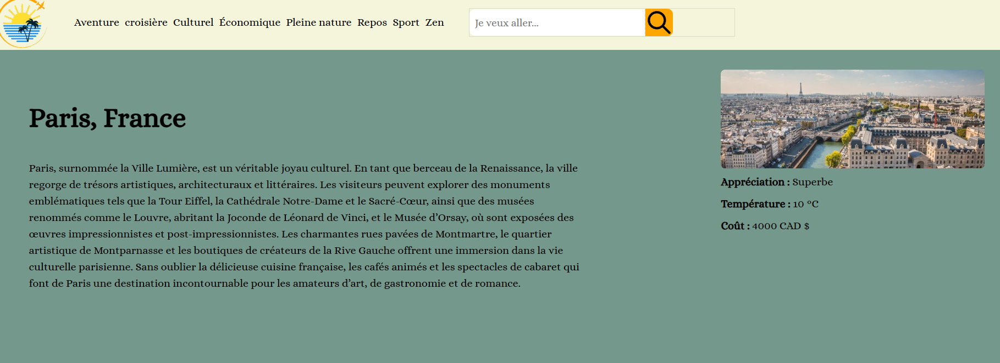

# TP3 site de voyage
Première étape du développpement d'un thème WP
Auteur: Hannah Lauzon 1640340
Addresse de la page github
https://gftnth00.mywhc.ca/33we_14/front-page.php adresse du site

# Commit 10
- Ajout de la vague svg dynamiquement
- Ajout de fonction php pour générer du html au lieu de fonction wordpress. theme_33w_svg_wave()
- Ajout du caroussel en php sans fonction wordpress.
- Migration de function.php vers configuration-generale.php ainsi que mon-customizer.php

# Commit 9
Navigation complète et fonctionelle. Category.php fonctionne, car il y avait des problème on local et le lien ne pouvait pas accéder, mais sur le site cela fonctionne.
- Fixed le gros problème de la grille d'article qui overflow honrizontalement hors du site.
- Pour la remise que je ferai demain, je dois juste: Rajouter 70 images, températures et des ajustements css tels que les icônes dans le footer, rajouter des gap, etc.

# Commit 8
- Génération des info température, appréciation pour single.php (articles)
- Ce qui reste à faire:
- 1-Utiliser la logique dans front-page pour categorie.php
- Réparer le overflow-x des articles dans categorie.php
- Mettre à jour manuellement les 70 articles pour générer l'appréciation et température pour chaque
- 

# Commit 7
- Ajout de search.php et utilisation de la fonction de recherche de github
- J'ai corrigé la barre de recherche elle fonctionne, il ne reste qu'à corriger les pages sur lesquelles les liens mènent. Dans le prochain commit
- Ajout d'une page single.php
- La barre de recherche ne s'affiche plus dans le nav si on se trouve dans front-page.php, car elle se trouve dans le hero
Reste à:
- Ajustement css sur categorie.php
- Ajouter les images et ajuster le css dans single.php (les articles)

# Commit 6
- Supression de /sass/ entièrement, car il n'est pas nécéssaire sur le site en ligne.
- Ajout de l'image de héro

# Commit 5
- Création de le branche tp2_p1 suppression de le branche tp2
- Nettoyage de la structure sass (suppression de style.css et style.css.map du dossier /sass/)
- Retirer d'autre fichier innutile (nettoyage) index.html

# Commit 4
Remise tp1 p3
Correction de la base de donnée: 
- Ajout de Populaire
- Modification de index.php pour afficher uniquement les destinations populaires
- Arrengement horizontale pour la grille

# Commit 3
- J'ai nettoyé l'interté du code et commencé à corriger le tp1 partie 3.