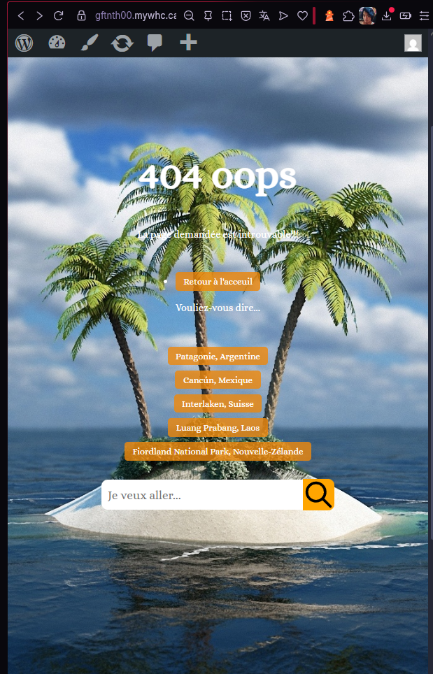
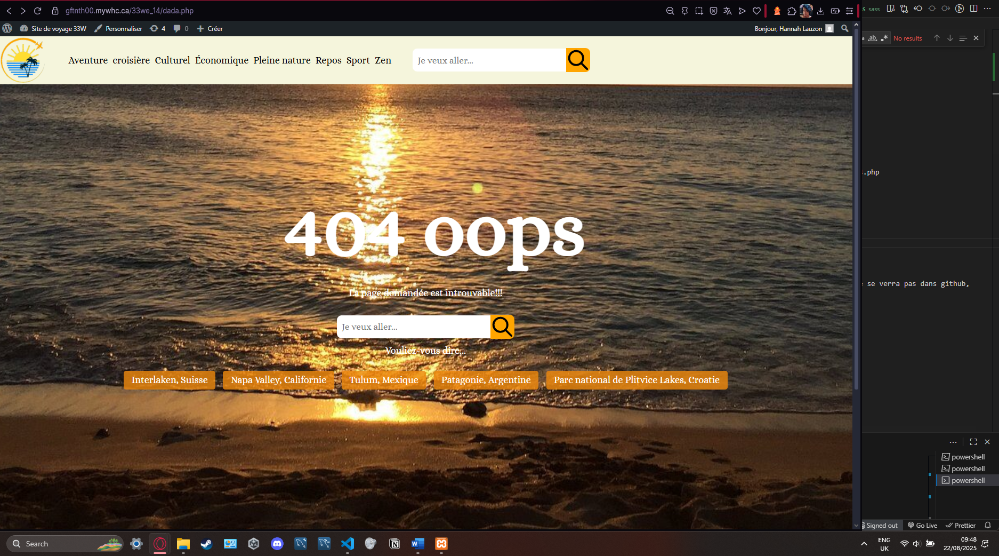

# TP3 site de voyage
Première étape du développpement d'un thème WP
Auteur: Hannah Lauzon 1640340
Addresse de la page github
https://gftnth00.mywhc.ca/33we_14/front-page.php adresse du site

# Commit 21
- Ajout des modifications du footer et post avec wordpress

# Examen finale (commit 19b et 20)
- (19) Corrige des petites erreurs pour le devis
- (20) Modifie le CSS pour ressembler aux maquettes. 
- (20) Interface qui est mobile-friendly
- 

# Examen final (commit 15 16 17 18 19) Sur la branche tp2 (et pas tp2_finale)
- (15) Création de la branche tp2 pour la correction de l'examen (pas la branche tp2_finale)
- (15) Création de gabarit\erreur-404.php
- (15) Modification de functions.php et index.php pour handle la nouvelle page erreur-404.php
- (16) Modification de index.php pour utiliser gabarit\erreur-404.php
- (17) Modification de functions\configuration-generale.php et de functions\mon-customizer.php pour erreur-404.php
- (18) CSS sass\layout\_erreur.scss
- (19) Remise de l'examen final (https://gftnth00.mywhc.ca/33we_14/wp-admin/admin.php est up to date)
- 
 
# Commit 14
- Ajout de la vague dans category.php
- Ajout de toutes les 70 images, températures et critiques
- Remise finale tp2 partie 2

# Commit 13
- Correction de la position du footer et la vague dans single.php
- Début de la finition d'ajout des images, températures et qualité dans les 35 destiantions restantes (cela ne se verra pas dans github, mais wordpress. Je ne ferai pas un autre commit si je ne vois pas d'erreur)

# Commit 12
- Ajout, dans le customizer de 2 panels: ✅ Hero et ✅ Footer.
- Hero peut modifier ✅ les images du carroussel. ✅ La couleur de fond et ✅ le contenu du texte.
- Footer peut modifier le courriel ✅ le nom ✅ et le texte du input ✅
- Il y a un fadein pour le carrousel ✅
- Les get_template ont été tous supprimé. Les fonctions ont été rajouté dans functions.php.
- Création de vague.php dans functions/ pour créer la vague
- Suppression de gabarit/ ainsi que son contenu: carte.php, fake-hero.php, galerie.php, hero.php
- Ajustement CSS du footer

# Commit 11
- Début du changement de tous les get_template vers des fonction php dans functions.php

# Commit 10
- Ajout de la vague svg dynamiquement
- Ajout de fonction php pour générer du html au lieu de fonction wordpress. theme_33w_svg_wave()
- Ajout du caroussel en php sans fonction wordpress.
- Migration de function.php vers configuration-generale.php ainsi que mon-customizer.php

# Commit 9
Navigation complète et fonctionelle. Category.php fonctionne, car il y avait des problème on local et le lien ne pouvait pas accéder, mais sur le site cela fonctionne.
- Fixed le gros problème de la grille d'article qui overflow honrizontalement hors du site.
- Pour la remise que je ferai demain, je dois juste: Rajouter 70 images, températures et des ajustements css tels que les icônes dans le footer, rajouter des gap, etc.

# Commit 8
- Génération des info température, appréciation pour single.php (articles)
- Ce qui reste à faire:
- 1-Utiliser la logique dans front-page pour categorie.php
- Réparer le overflow-x des articles dans categorie.php
- Mettre à jour manuellement les 70 articles pour générer l'appréciation et température pour chaque
- 

# Commit 7
- Ajout de search.php et utilisation de la fonction de recherche de github
- J'ai corrigé la barre de recherche elle fonctionne, il ne reste qu'à corriger les pages sur lesquelles les liens mènent. Dans le prochain commit
- Ajout d'une page single.php
- La barre de recherche ne s'affiche plus dans le nav si on se trouve dans front-page.php, car elle se trouve dans le hero
Reste à:
- Ajustement css sur categorie.php
- Ajouter les images et ajuster le css dans single.php (les articles)

# Commit 6
- Supression de /sass/ entièrement, car il n'est pas nécéssaire sur le site en ligne.
- Ajout de l'image de héro

# Commit 5
- Création de le branche tp2_p1 suppression de le branche tp2
- Nettoyage de la structure sass (suppression de style.css et style.css.map du dossier /sass/)
- Retirer d'autre fichier innutile (nettoyage) index.html

# Commit 4
Remise tp1 p3
Correction de la base de donnée: 
- Ajout de Populaire
- Modification de index.php pour afficher uniquement les destinations populaires
- Arrengement horizontale pour la grille

# Commit 3
- J'ai nettoyé l'interté du code et commencé à corriger le tp1 partie 3.